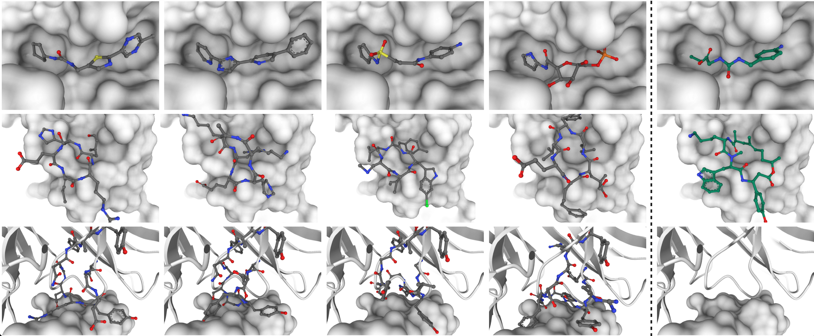
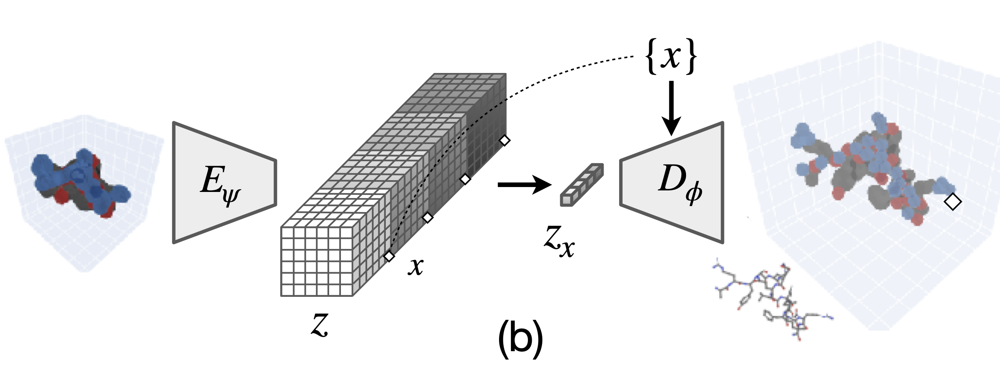
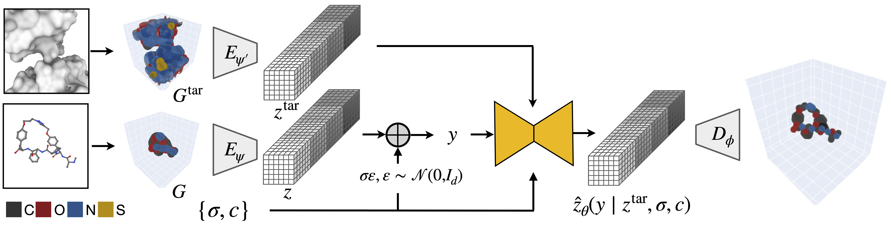

# Unified all-atom molecule generation with neural fields
This repository contains implementation of [FuncBind](https://arxiv.org/abs/2511.15906), a model for target-conditioned 3D molecule generation using neural fields. This unified model can be trained across drug modalities.

```
@inproceedings{kirchmeyer2025funcbind,
  title={Unified all-atom molecule generation with neural fields},
  author={Kirchmeyer, Matthieu and Pinheiro, Pedro O and Willett, Emma and Martinkus, Karolis and Kleinhenz, Joseph and Makowski, Emily and and Watkins, Andrew and Gligorijevic, Vladimir and Bonneau, Richard and Saremi, Saeed},
  booktitle={NeurIPS},
  year={2025},
}
```
This model buils upon its unconditional version, FuncMol:
```
@inproceedings{kirchmeyer2024funcmol,
  title={Score-based 3D molecule generation with neural fields},
  author={Matthieu Kirchmeyer and Pedro O. Pinheiro and Saeed Saremi},
  booktitle={NeurIPS},
  year={2024},
}
```


## 1. Quick start

Multi GPU support is managed with Pytorch Lightning Fabric.
Configs are managed with Hydra and logging is managed by WandB.

Install the environment with mamba / micromamba (or conda).
```bash
micromamba create -n funcbind -c conda-forge -c bioconda python=3.12.9 anarci
micromamba activate funcbind
python -m pip install -r requirements.txt
```

Don't forget to activate the env with `micromamba activate funcbind`.
The configs in this code assume access to a B200 GPU; there is an option to choose the `gpu_type` to be `b200` or `a100` in the config. The `a100` option has not been thoroughly tested recently and will very likely require some adjustments to fit fully the A100's memory.

## 2. Prepare training data

Data is placed in `funcbind/dataset/data/`.

### a. CrossDocked dataset
Place the Crossdocked data in `funcbind/dataset/data/crossdocked_pocket10/`.

We provide the preprocessed crossdocked train and test `.pt` on [HuggingFace](`https://huggingface.co/mkirchmeyer/funcbind/`) under `crossdocked_pocket10`.
Place the `.pt` files in `dataset/data/crossdocked_pocket10`.

If you want to reprocess them from scratch:
1. Download `split_by_name.pt` and `crossdocked_pocket10.tar.gz` from this [link](https://drive.google.com/drive/folders/1CzwxmTpjbrt83z_wBzcQncq84OVDPurM) (provided by TargetDiff, see their [README](https://github.com/guanjq/targetdiff)), place in `funcbind/dataset/data/` and decompress with `tar xvzf crossdocked_pocket10.tar.gz`

2. Run `cd funcbind/dataset; python preprocess_crossdocked.py`. The script will generate the following files in the `dataset/data/` folder: `train_data.pt`: contains the train/val splits; `test_data.pt`: contains the test split.

Note that the metrics computation require the uncropped complexes (downloadable from [TargetDiff](https://github.com/guanjq/targetdiff)) which should be stored under `crossdocked_v1.1_rmsd1.0`.

### b. Macrocyclic peptide pair dataset
We provide the preprocessed MCP `.pt` files on [HuggingFace](https://huggingface.co/datasets/Willete3/mcpp-dataset) under `mcpp_dataset` as well as the original .pdb files. Place the `.pt` files in `dataset/data/mcpp_dataset`.

If you want to reprocess teh data from scratch, run:
1. Download the `.tar.gz` file from [HuggingFace](https://huggingface.co/datasets/Willete3/mcpp-dataset/blob/main/mcpp_dataset.tar.gz), place them under `funcbind/dataset/data/mcpp_dataset` and untar it.
2. Then, run the following command: `cd funcbind/dataset; python preprocess_mcp_pair.py`


### c. SabDab dataset
We preprocessed an internal SabDab data (used for training AbDiffuser, one of our baselines) by running the following command, which will place the data in `funcbind/dataset/data/sabdab_v0.5.2_diffab_chothia/`.
```bash
cd funcbind/dataset; python preprocess_sabdab.py
```
However, we have not adapted the script to be compatible with other public SabDab sources e.g. from [DiffAb](https://github.com/luost26/diffab).
We are still working on updating the code to read directly public sabdab data sources.

## 3. Sample from the model

### a. Download checkpoints

Model weights are stored on [HuggingFace](https://huggingface.co/mkirchmeyer/funcbind).
Save `nf_unified` under `exps/neural_field/nf_unified/` and `fb_unified` under `exps/funcbind/fb_unified/`.

### b. Sampling - paper's test split

Configs for sampling are:
* `funcbind/configs/sample_fb_mcpp.yaml`: for sampling macro cyclic peptides.
* `funcbind/configs/sample_fb_ab_X.yaml` where `X is either H1, H2, H3, L1, L2, L3`: for sampling CDR X loop.
* `funcbind/configs/sample_fb_crossdocked.yaml`: for sampling small molecules.

Change the sampling scripts depending on the application using `--config-name`. Eg, to smple MCPs (or the above other options), run
```bash
python sample_fb.py --config-name sample_fb_mcpp
```

#### With WandB sweeps

We can make this process faster by creating a sweep of sampling runs:
* `fb_sweep_crossdocked.yaml`: sweep of small molecule sampling
* `fb_sweep_mcpp.yaml`: sweep of MCP sampling
* `fb_sweep_cdrs_aug.yaml`: sweep of CDR H1,H2,L1,L2,L3 sampling
* `fb_sweep_cdrs_H3.yaml`: sweep of CDR H3 sampling
```bash
cd funcbind
wandb sweep wandb_sweep/fb_sweep_mcpp.yaml
python ./sbatch/sbatch_wandb_agent.py  --wandb_agent prescient-design/funcbind/5ckbpcbb --n_jobs 4 --job_template ./sbatch/job_template_1gpu.sbatch
```
where `4kaqomta` is the sweep id (after executing `wandb sweep wandb_sweep/fb_sweep_mcpp.yaml`) and `n_jobs` is the number of jobs that are part of that sweep.

To aggregate the metrics across the same WandB sweep e.g. `5ckbpcbb`, run:
```bash
cd funcbind/metrics
python aggregate_metrics.py sweep_id_list=["5ckbpcbb"] use_single_dataset=mcpp
```
Be sure to change `use_single_dataset` to `xdocked` if sampling small molecules, `sabdab` if sampling CDR loops.

### c. Sampling - given external .pdb file

```bash
python sample_fb.py --config-name=sample_fb_pdb pdb_path=test/10677_7chb_HL_A.pdb dset.use_single_dataset=sabdab
python sample_fb.py --config-name=sample_fb_pdb pdb_path=test/5liu_X_rec_4gq0_qap_lig_tt_min_0_pocket10.pdb dset.use_single_dataset=xdocked sampler.beta=2
python sample_fb.py --config-name=sample_fb_pdb pdb_path=test/6xif-protein.pdb dset.use_single_dataset=mcpp sampler.beta=3
```
Be sure to update `pdb_path` with the corresponding .pdb file.
* for the antibody setting (e.g. `pdb_path=test/10677_7chb_HL_A.pdb`), this code assumes that the .pdb contains both a binder and a target (the code can be easily extended to the setting where there is only a target in the .pdb file). By default CDR loop inpainting is set to H3 only (though this can be changed in `read_ab_structures.py`).
* for the small molecule (e.g. `pdb_path=5liu_X_rec_4gq0_qap_lig_tt_min_0_pocket10.pdb`) and MCP setting (e.g. `pdb_path=test/6xif-protein.pdb`), the .pdb should contain only the target, while the ligand's .sdf file is provided separately (if available). If the ligand is not available, the pocket's center has to be set using `receptor_center=[X,X,X]` (no space between `,`) which is otherwise set using the ligand's center of mass from the corresponding .sdf file (`5liu_X_rec_4gq0_qap_lig_tt_min_0.sdf` and `6xif-CP.sdf`).

## 4. Train the neural field
To train the neural field on one modality (`dset.use_single_dataset=xdocked` for small molecules, `dset.use_single_dataset=sabdab` for CDR loops, `dset.use_single_dataset=mcpp` for MCPs) run:
```bash
python train_nf.py --config-name=train_nf dset.use_single_dataset=xdocked
```


If `dset.use_single_dataset=null` then training will be done on the 3 modalities (note that we do not provide the sabdab training data).

This will save a checkpoint in in the folder `exps/neural_field/MY_NF/`, where `MY_NF` is either generated based on timestamp or can be set via `exp_name`.

## 5. Train FuncBind with a pre-trained neural field
Once you have a trained neural field, run:
```bash
python train_fb.py --config-name=train_fb nf_pretrained_path=exps/neural_field/MY_NF/ dset.use_single_dataset=xdocked
```


to train it on one modality (`dset.use_single_dataset=xdocked` for small molecules, `dset.use_single_dataset=sabdab` for CDR loops, `dset.use_single_dataset=mcpp` for MCPs).
If `dset.use_single_dataset=null` then training will be done on the 3 modalities (note that we do not provide the sabdab training data).